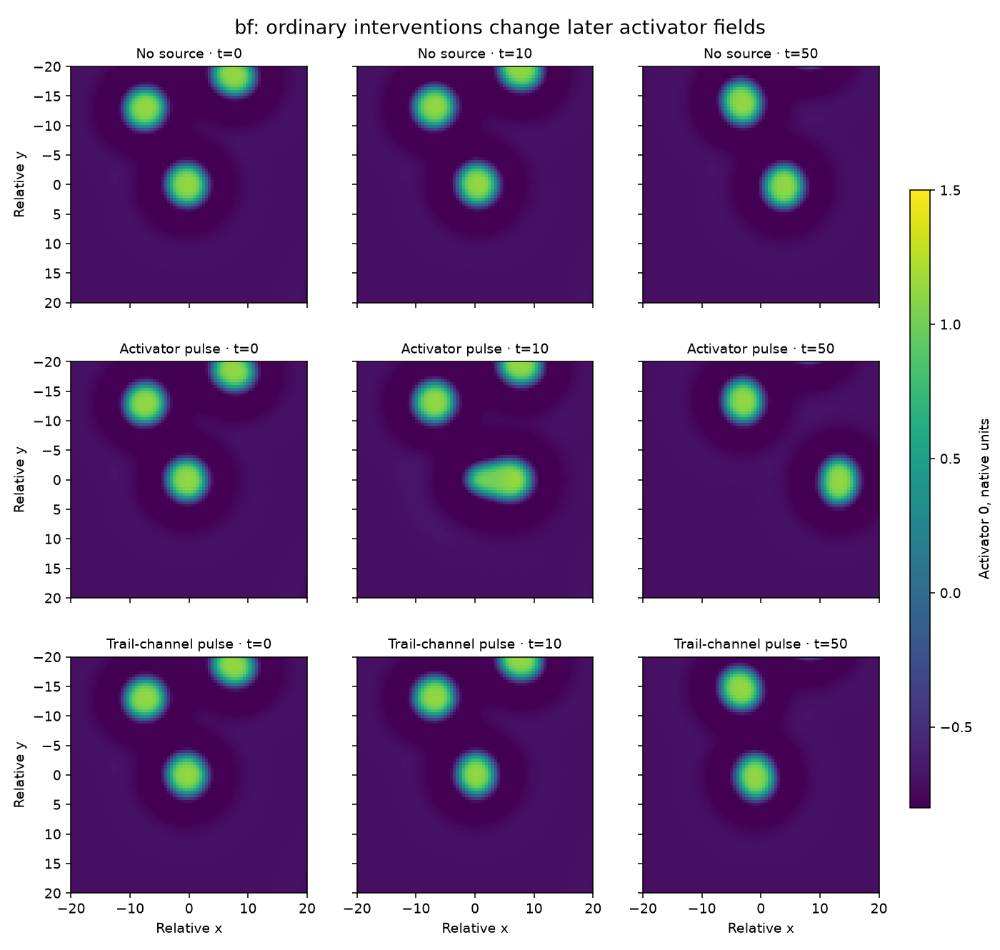
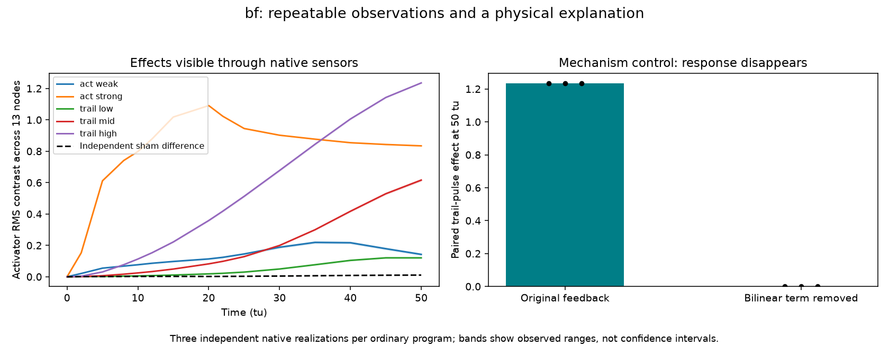
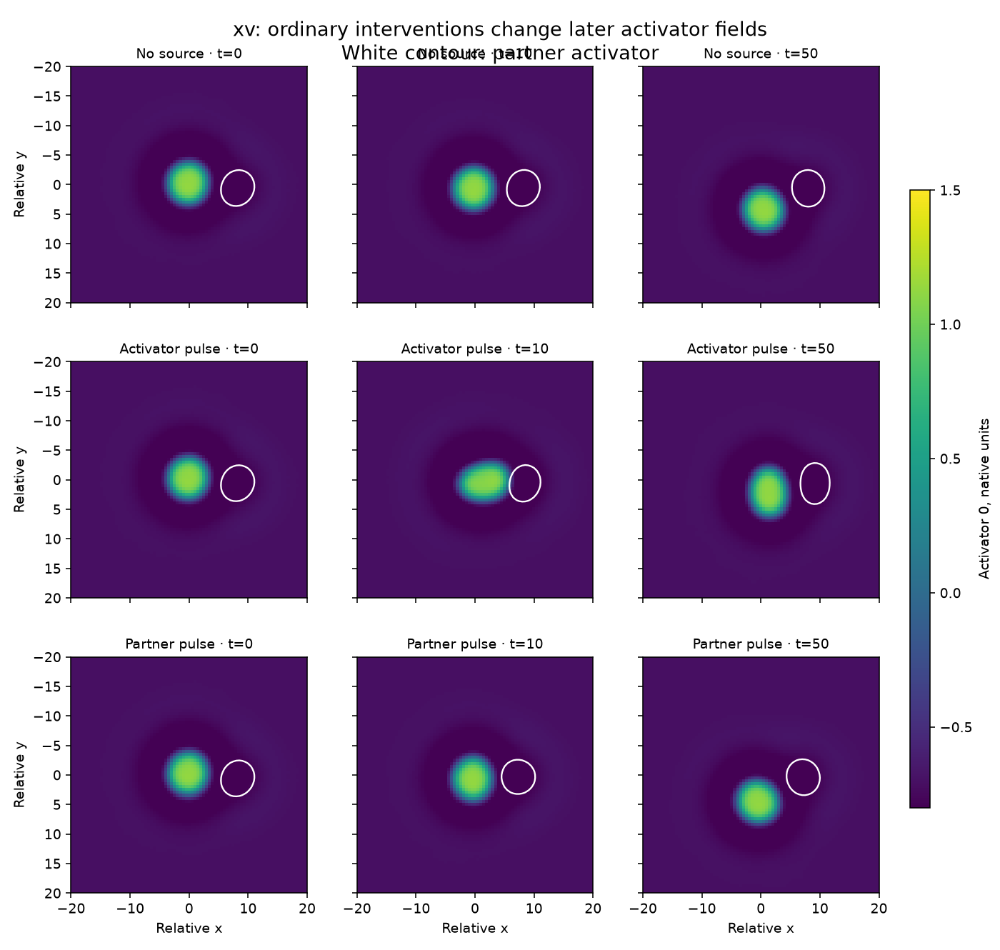
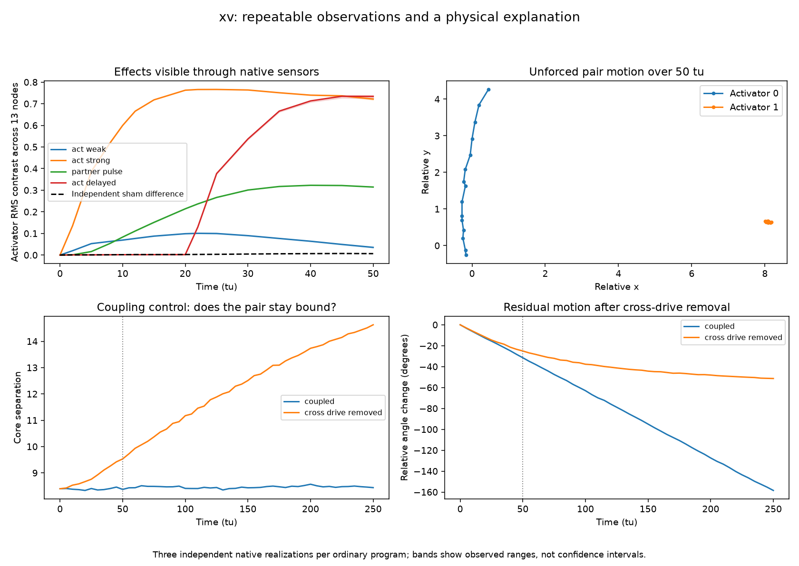

# BF and XV: preparation for evaluation and science rollouts

Investigation started 2026-09-13 and completed 2026-09-14 (Europe/Lisbon).

**Completed:** `bf_trail_lab` and `xv_rotor_lab` are now eval-ready. The registry
contains 24 world records: 21 preserved and three eval-ready, including the
original `p4g2_044` preparation. These records refer to 19 distinct genomes.

## What was investigated

BF was taken through the scientific preparation and native validation workflow
first. XV followed using the same preparation, observation, bundle and scoring
recipes. The model pilots use stock Verifiers with its Bash harness and a Docker
runtime. They receive anonymous laboratory tools, observations and the prediction
contract. They do not receive genome equations, spatial fields, physical labels,
probe geometry, grading programs or truth.

Each laboratory starts from the exact saved endpoint of a fresh 2,500-tu native
simulation. BF uses the first soup realization (seed 11001). XV uses the prepared,
un-kicked pair (seed 12001). The selected activator-0 maximum determines the probe
centers, and the emitter is six units away. These are specific preparations, not
claims about every initial condition of either genome.

Both suites contain 11 action/query programs with three independent development
realizations apiece, a 50-tu horizon, two separately seeded grading truths per
case, and four frozen score groups. Activator histories, feedback channels and
spatial response are assessed together. The groups and coordinate scales were
frozen before generating grading truth. The standard predictor contract requests
64 coherent forecast members.

## BF: a persistent trail changes later motion

BF has one activator and three channels. Its trail channel has zero diffusion and
a 200-tu relaxation time. An ordinary five-tu source pulse into that channel
changes the activator's later spatial trajectory, long after the pulse ends.

The 50-tu activator contrast across the 13-node probe is 0.121, 0.616 and 1.235
for trail amplitudes 0.002, 0.01 and 0.05, respectively. The mean difference
between independent no-source realizations is 0.0106. These are RMS differences
in native sensor units, not displacement or a universal signal-to-noise metric.

The mechanism control starts from identical fields and pairs the future noise.
Disabling only the bilinear reaction term makes the trail pulse's activator
effect **exactly zero** in all three repetitions. With the original reaction,
the corresponding effects are 1.2346, 1.2348 and 1.2338. The control is privileged;
the positive trail pulse used to reveal the effect is an ordinary admitted action.

This preparation provides a concrete science task: discover a persistent field
that modifies later responses and motion, distinguish its effect from ordinary
activator forcing, and predict delayed or combined interventions.

## XV: cross-coupling binds an orbiting pair

XV has two activators and four channels. Over a fresh unforced 50-tu continuation,
activator 0 sweeps around a much less mobile partner. A weak activator pulse largely
relaxes, while stronger and delayed pulses produce persistent differences. A
pulse into the partner also changes the first activator's readings.

At 50 tu, strong activator and partner pulses yield RMS contrasts of 0.722 and
0.315, compared with an independent-sham difference of 0.00658. The weak pulse's
contrast falls to 0.0355. These observations distinguish response strength,
timing and cross-organism influence through the actual sensor interface.

Removing cross-drive source terms from an already rotating pair does not
immediately stop it. After 50 tu the original pair has turned 31.5 degrees and
remains 8.37 units apart; the control still turns 25.1 degrees but separates to
9.53 units. A longer 250-tu control resolves the distinction: the intact pair
turns 158.5 degrees and remains 8.44 units apart, whereas the decoupled pair turns
51.4 degrees and separates to 14.63 units. The first 50 tu of this extension
match the original fields and all three sensor realizations bit for bit.

The spatial curves show the first realization; sensor response bands show the
range of three realizations. They are not confidence intervals. The 250-tu
extension is a privileged science control outside the 50-tu agent contract.
The evidence supports sustained orbital binding through coupling, while allowing
residual motion after its removal. It does not establish an instantaneous stop.

## Scoring and model pilots

Final score and rollout receipts are in each world's `control_summary.json`,
`pilot_summary.json`, `native_validation.json` and `registry_receipt.json`, under
`outputs/eval-preparation-20260913/`. Lower joint energy scores are better; scores
should be compared within a suite, since the physical groups and scales differ.

| Predictor / control | BF | XV |
|---|---:|---:|
| Independent native simulator | 0.00196 | 0.00271 |
| Native simulator, ignore actions | 0.28897 | 0.18292 |
| Native simulator, remove feedback | 0.11197 | 0.23514 |
| Native simulator, wrong probe geometry | 0.53169 | 0.62268 |
| Initial persistence | 0.46001 | 0.42990 |
| DeepSeek V4 Flash, one native rollout | 0.49675 | 0.18418 |

The native controls use four independent forecast members and are privileged
diagnostics. Model submissions use 64 members; persistence is deterministic.
All controls and model predictions are compared with the same frozen truth for
their respective suites. The suites remain frozen after examining pilot scores.

BF's DeepSeek V4 Flash pilot used 12 experiments, 83 tu, and 52 model calls.
It submitted a valid predictor and all 11 cases graded. Its score was 0.49675,
slightly worse than initial persistence (0.46001). Its longest observed experiment
was only 10 tu despite a 50-tu prediction horizon. Inspection of its predictor
shows response interpolation/extrapolation rather than a recovered trail model.
Successful execution therefore is not evidence of successful physics discovery.
The provider-reported inference cost was $0.066.

XV's pilot used 12 experiments, 125 tu, and 41 model calls. It repaired one
array-shape error through public validation, submitted successfully, and all 11
cases graded. It scored 0.18418 against persistence's 0.42990. Unlike BF, it
observed a complete 50-tu no-source trajectory. Its no-source score is 0.00183,
but strong activator and cross-feedback programs score 0.43590 and 0.37390.
Its predictor interpolates the observed baseline, models a limited set of
responses, and ignores unobserved injection ports. Its overall score is close
to the privileged native control that ignores every action (0.18292); improvement
over persistence is therefore not evidence that it recovered the coupling law.
The provider-reported inference cost was $0.0504, or **$0.1164 for both pilots**.

## Reproduction and interpretation limits

Use the reusable [workflow](../../generators/physim/EVALUATION_WORKFLOW.md).
The registry preserves the full runnable bundles, original simulation endpoints,
generation/preparation recipes and source versions, ordinary observations,
scientific evidence, and model predictor/observation/grade artifacts. Exporting a
recipe or bundle does not execute archived code. Bundle reconstruction verifies
every manifest and truth file before exposing the eval-ready status.

Both exported preparation recipes reproduce `world.json`, `apparatus.json` and
`preparation.npz` byte for byte from their archived inputs. The complete registry
also passed release-staging verification. All 55 prior immutable JSON records
are unchanged; the catalog now verifies 24 world records and 204 artifacts.

Final verification: **126 tests and 216 subtests passed**, including package
builds and the original reference-score check. All 678 checked documentation
links pass. Both pilot containers were removed. `completion.json` records the
bundle identities, file hashes, numerical results and verification receipts.

The first BF bundle build failed in a reference helper that assumed 12 ports.
The repaired build retained all 11 original truth files with unchanged hashes;
the failed and repaired executed source versions are archived. The first BF model
attempt stopped before inference because Verifiers required a typed stop hook.
After fixing that annotation, the ordinary rollout completed. These failures are
kept in the evidence rather than counted as model failures.

The environment now derives port count from validated genome dimensions and
accepts zero diffusion for stationary channels. BF has four ports, XV six, and
the original worked example twelve. Numerical stepping, source/probe operations
and scoring kernels are unchanged. Docker interface checks passed at four and
six ports. All 52 locked Blobkit files retain their hashes.

These are local development preparations. One preparation per genome, three
development repeats, two grading truths and one model pilot are not a benchmark
of generalization or a reliable comparison of models. The registry's eval-ready
label means a verified runnable preparation/suite; it does not imply publication.
No GPU rental was needed.

`measurements.json` records the definitions and numerical observations. The
executed-source archive is in `source/`; the prior registry-object hashes are in
`registry_before.json`. Logs preserve the build, validation and rollout attempts.
XV's private case ID `slow_feedback` is a label from preparation development;
its actual action is public port 0, which maps to field 4 (the fast, diffusive
inhibitor). Interpretation follows the genome and port map, not that label.
