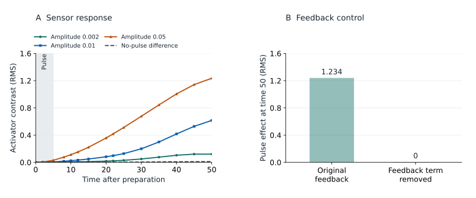

# Centered-source preparation evidence

All three laboratories were re-simulated with `centered-pulse-v2`. Initial
fields are preserved; these are new continuations, interventions, independent
grading truths, and controls. Historical bundles remain unchanged. Each
development program has three independently seeded continuations. BF and XV
have 15 programs each; p4g2_044 has 19.

## BF: a centered trail pulse still changes later activator motion

A five-time-unit pulse into the non-diffusing trail produces a response in the
activator that persists to time 50. At that time the mean RMS sensor contrast
against the independent no-pulse mean is 0.0486, 0.1928, and 0.7539 for pulse
amplitudes 0.002, 0.01, and 0.05. The readings use all 13 device-0 positions.
These are physical response magnitudes, not energy scores or rewards.

Paired future-noise comparisons isolate the mechanism. With the original
bilinear feedback, pulse-minus-sham activator RMS at time 50 is
0.753807, 0.756069, and 0.755012 across three pairs. Removing only the bilinear
term makes the pulse and sham activator arrays exactly equal. The source acts
on the trail, and the downstream activator effect requires the feedback term.
The agent cannot perform this privileged model intervention.

The suite retains fixed scales 1.0 (activator), 0.5 (local feedback), 0.05
(trail), and 1.0 (wide activator array), chosen before new truths. New native
diagnostic energy scores are 0.002212 for independent native forecasts,
0.202241 for ignoring actions, 0.138328 for removing feedback, 0.467851 for
wrong probe geometry, and 0.497009 for initial persistence. Stochastic controls
use four forecast members; agent submissions use 64. Persistence is
deterministic, so its reference does not change with member count.

## Launch position and ordering are observable

Four additional programs test pulse-then-move, move-then-pulse, independent
sources on both instruments, and movement while an earlier pulse continues.
The first pair has the same final probe pose, but a different captured source
location. We compare activator-0 readings across device-0 slots at time 50:

| World | Pulse ordering contrast, RMS | No-pulse variation, RMS |
| --- | ---: | ---: |
| BF | 0.791058 | 0.010593 |
| XV | 0.556952 | 0.006578 |
| p4g2_044 | 1.199848 | 0.000559 |

Ordering contrast is RMS between the two three-run ensemble means. No-pulse
variation is the mean RMS over the three distinct pairs of no-pulse runs.
These are descriptive contrasts with different sampling constructions, not
effect-size ratios or confidence intervals. p4g2_044's null program contains a
zero-amplitude pulse. All effects are comfortably visible above the measured
run-to-run differences.

## XV: distinguish motion from sustained cross-field interaction

The fresh coupled continuation turns by -0.5503 radians over 50 time units;
removing cross-drive still allows a transient turn of -0.4374 radians from the
same prepared fields. Final separation is 8.37 versus 9.53 units, starting at
8.40. Thus the control does not support a claim that cross-drive removal
immediately stops motion. The short evaluation horizon probes observable
trajectories and responses; longer-run binding claims require the separate
long-horizon evidence preserved in the original investigation.

## Evidence and reproducibility

All three bundles passed native service checks, exact reference-score
reproduction, and registry export/reload. The local staged registry contains
the three new preparations and their recipes; no new HF publication is implied
by staging them.

| Preparation | Cases | Persistence energy | Persistence reward |
| --- | ---: | ---: | ---: |
| BF | 15 | 0.497009 | 0.667999 |
| XV | 15 | 0.427852 | 0.700353 |
| p4g2_044 | 19 | 0.872991 | 0.533906 |

The equal-world persistence reward is **0.634086**. It repeats the initial
sensor readings for every future request, regardless of actions or motion.
This deterministic baseline can be compared directly with 64-member model
submissions. The other controls remain four-member privileged diagnostics;
their aggregate rewards and per-world scores are retained in
`outputs/evaluation-campaign-20260916/baselines.json`.

- Development observations, field frames, request receipts and native controls:
  `outputs/eval-preparation-20260916/{bf,xv,p4g2_044}`.
- BF figure data and hashes: `docs_source/data/bf-evaluation.{npz,json}`.
- Every truth bundle is checked through the public service, invalid-request
  handling, all retained truth arrays, and the frozen persistence reference.
- The first new BF bundle also passes the full stock-Verifiers/Docker workflow
  using a local scripted model: experiment, validate, submit, freeze and grade.
  Energy is 0.49700866885207146 and API spend is zero.
- Campaign source archive, package versions and Docker image IDs:
  `outputs/evaluation-campaign-20260916/provenance.json`.
- A fresh install from the built environment wheel and published Blobkit wheel,
  outside the checkout, reproduces BF's reference and runs a centered-source
  experiment. Report: `outputs/evaluation-campaign-20260916/clean-install.json`.

During development, automatic formatting was applied to the preparation
scripts after science processes had started. The numerical implementation
hashes remained unchanged. BF/XV's original recipe was recovered byte-for-byte
against its recorded SHA-256 and archived under
`outputs/evaluation-campaign-20260916/source-history`; its parsed Python AST
matches the formatted file exactly. p4g2_044's original recipe hash remains
in its origin record; the archive contains its formatted equivalent, rather
than claiming a byte-exact copy of that initial recipe. Raw receipts have not
been rewritten. The original bundle-building code is also archived by hash.
The p4 build resumed after repairing a rectangular-matrix error in its new
feedback diagnostic. All completed truths and independent-native/ignore-action
forecasts were reused; no feedback or geometry control had been saved before
the failure. The revised diagnostic removes feedback from shared channels by
zeroing the corresponding columns of the activator-by-channel matrix. A test
checks that unshared feedback, channel production, and input arrays are retained.
The builder hashes, frozen suite, seeds, and both build logs document recovery.
