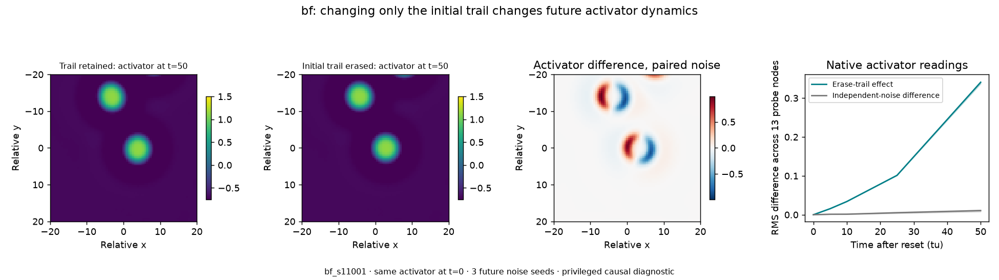
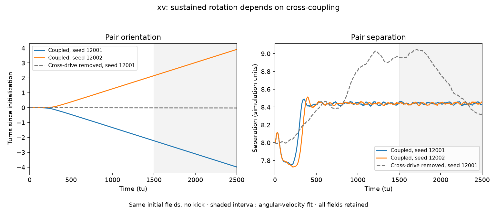
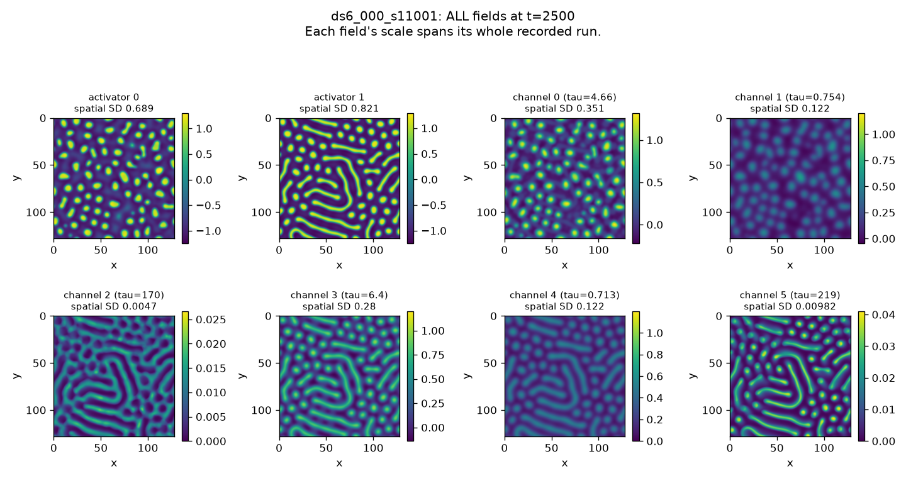

# Fresh world phenomenology — 2026-09-13

The clearest newly reproduced mechanisms are **BF's trail-mediated memory** and
**XV's prepared rotating pair**. M4 supplies a simpler moving-blob system.
DS6_000 supports a richer, changing spatial landscape. MV3's fresh random starts
show different motion roles, but do not establish sustained cargo transport.

Completed: **17 × 2,500-tu simulations and 150 × 50-tu sensor trajectories**,
50,000 simulated time units in total. All runs completed and the artifact audit
passed. [Measurement tables](MEASUREMENTS.md) give the values for every start.

These are findings from fresh simulations and interventions, not inherited
descriptions or a ranking by search score. The registry now records only
**preserved** or **eval-ready**. Its 22 records represent 19 genomes: 21 records
are preserved and the existing `p4g2_044` preparation remains the sole eval-ready
record. This investigation creates no additional evaluation bundle.

## What the experiments show

| World / preparation | Fresh evidence | Interpretation and limits |
|---|---|---|
| `bf`, two random starts | Twelve persistent organisms in each run; almost all tracked motion samples are moving. Erasing only the initial trail changes later activator readings by **11.2–32.0×** the ordinary independent-noise difference. | A concrete memory-dependent mechanism, observable over the environment's 50-tu horizon. The erasure is a privileged causal diagnostic, not an agent action. |
| `xv`, nearby prepared pair | Both runs sustain rotation without an initial kick. Angular velocities are **−0.011109** and **+0.011074 rad/tu**, with separation near **8.44**. Removing cross-drive reduces the fitted rate to **−0.00002178 rad/tu**. | Strong evidence for interaction-driven rotation. Preparation matters: the widely separated random starts were mostly quiet and did not establish rotors. |
| `m4`, two random starts | Twelve organisms persist in each run, with moving fractions **1.000 / 0.9996**. Both show substantial 50-tu native-sensor drift and pulse response. | A useful simpler motion system. The soup initializer includes a kick; these runs do not demonstrate spontaneous launch from rest or difficulty beyond a fitted motion predictor. |
| `ds6_000`, two random starts | **146 / 148** organism-level components at the endpoint; changing spots and stripe-like patches, with activator occupancies about **17% / 24%**. Strong-pulse responses exceed ordinary noise differences in both preparations. | Rich spatial reorganization and memory fields, without a uniform activator carpet. This is a more complicated observation problem; these experiments do not establish an agent score or controllable assembly. |
| `mv3`, two random starts | Eight organisms remain; aggregate moving fractions **0.539 / 0.529**. Engines travel while cargo is mostly stationary, and the third activator disappears. | Distinct roles are visible. Reliable delivery/release is not reproduced by these runs and should not be advertised from the historical label. |
| `m0`, two random starts | Twelve stationary organisms; moving fraction and C9 both zero. | A useful static control. Static unforced behavior still permits a substantial response to a sufficiently strong source pulse. |
| `p4g2_044`, two random starts | Activator 2 occupies **85.1% / 77.0%** of the domain at 2,500 tu. C9 is **0 / 0**, with `box_limit=true` and memory-extension triggers in both runs; the second also triggers organism extension. | Dense, evolving patterns rather than a clean sparse-body system. These starts are still changing at the observation boundary and are not certified as settled evaluation preparations. |

The `p4g2_044` random-start runs are separate from the already validated evaluation
preparation; their diagnostics do not replace that preparation's truth or scores.
Its zero C9 includes a zero traversal component and does not imply an absence of
all dynamics: the full fields show evolving stripes, backgrounds and localized
peaks. It does mean the historical reputation alone is insufficient evidence for
these particular preparations under the current spatial rubric.

### BF: intervene on memory, observe the activator

Each comparison starts from the exact same activator and inhibitor fields. The
intervention sets only BF's third channel—the relaxing trail—to zero at time
zero. Each treatment/control pair receives identical future noise; three future
noise seeds separately measure reproducibility. The reported effect uses only
the **activator** readings, so it cannot be explained by directly reading the
channel that was erased.

At 50 tu, activator RMS effects across the 13 sensor nodes are 0.337–0.344 for
preparation 11001 and 0.0690–0.0695 for preparation 11002. The ratios above divide
each preparation's mean paired effect by the mean difference between its three
independent baseline pairs. These overlapping pairs are descriptive comparisons,
not three independent statistical replications or confidence intervals.



### XV: preparation and a mechanism control

The prepared pair consists of two installed A4 deviation stamps, centered eight
simulation units apart with their private inhibitor shadows. Both coupled runs
and the control have byte-identical initial fields. The control changes only
the two off-diagonal entries of `W` and a descriptive genome name.

The opposite directions arise under different future noise seeds from the same
initial fields. The two speed magnitudes agree within 0.4%; the pair remains
intact in all 501 recorded frames of each run. Late separation standard
deviations are 0.0107 and 0.00974 units. The same-seed control rotates about
**510× more slowly** by the fitted late angular velocity. This is one control
realization, not a broad survey over parameters or resolutions.



### Full-field inspection

All activators and channels are retained, including dense backgrounds and slowly
relaxing fields. The DS6_000 image illustrates why blob counts alone are
insufficient: compact peaks, elongated patches and diffuse memory coexist.
Each panel's scale spans that field's entire recorded run.



## Protocol and interpretation

The battery uses the installed Blobkit 0.3.5 CPU simulator, float32, a periodic
128 × 128 domain (256 × 256 cells), `dx=0.5`, `dt=0.02`, and noise amplitude 0.002. Seven genomes
are simulated for 2,500 tu with seeds 11001 and 11002. The default soup contains
twelve dressed pokes and the initializer's default `kick_px=0.5` inhibitor-shadow
kicks, including when no world-specific kick override is supplied. The separate
XV experiment uses seeds 12001/12002 and **no kick**.

Full-field snapshots are saved every 250 tu. The current V3 research source is
applied to installed V1/V2 measurements, using all seven late snapshots from
1,000 through 2,500 tu and carpet-aware void masks. The executed source uses
**W9=0.40**, despite an older header comment describing 0.25. C9 is a spatial
descriptor, not a physical mechanism certificate or evaluation score. Its
`economy` label does not establish transport, metabolism, or an emergent economy.
XV's first random-start run produces degenerate-cluster warnings during the
morphology calculation; its cluster counts are not evidence of new species.

The 2,500-tu window is fixed. Existing horizon-extension criteria are retained
in the data, and all fields are inspected separately from segmentation and
centroid tracks. A quiet extension diagnostic does not prove asymptotic
convergence. No fresh grid/time-step refinement study was performed.

For sensor experiments, the exact final fields are reset at time zero. Current
`physim.devices` source and bilinear probe operations are used with a 13-node
square probe centered by a fixed rule on the activator-0 maximum. The source is
offset six simulation units in x. Baseline, amplitude-0.05 and amplitude-0.3
Gaussian pulses are compared with three future noise seeds each; pulses last
five tu with width two simulation units. Readings are retained at 0, 5, 10, 25
and 50 tu. BF adds the trail-erasure arm. Controls and treatments share noise
within each pair; baseline members use independent future noise.

RMS values use raw field units. The cross-world table is an observation summary,
not a difficulty ranking: field scales and port counts differ. No learned
predictor, constant-velocity baseline, or held-out agent evaluation was run.
The current prepared evaluation loader also assumes the reference world's
four activators and eight channels; additional worlds still require a compatible
preparation, apparatus, task suite, truth and validation before being eval-ready.

## Evidence and reproduction

- `measurements.json` collects exact measurements and audit results.
- [MEASUREMENTS.md](MEASUREMENTS.md) presents the per-start measurements as tables.
- `inventory.json` gives sizes and SHA-256 hashes for the raw artifacts under
  `outputs/phenomenology-20260913/` in this checkout. These raw outputs are local
  and ignored by Git; they have not been uploaded to Hugging Face.
- Each run preserves its genome, protocol, full fields, final fields and full
  measurement record. Sensor samples and pair-angle traces are retained too.
- `source/` archives the executed analysis recipes, current V3 source, native
  device operations, numerical sources and stamp input. Its probe recipe is the
  exact executed version, before an import-order-only cleanup of the working copy.
- `registry_checks.json` verifies the two statuses, release staging round trip,
  and byte identity of all **55** immutable JSON records against the previous
  staged registry. The registry test set passes **18 tests**.
- `checks.json` records the complete battery, 52 unchanged locked Blobkit files,
  passing lint/format checks and 678 checked documentation links with no errors.
  `source_inventory.json` hashes the archived source and input files.

Run the recipes from the repository root in the development environment. Use a
new output directory; existing preparations are deliberately not overwritten.
Install Blobkit's `plot` extra for figures. Executed source hashes are recorded
alongside results, including the current research metric source outside the
installed package.

```sh
python generators/physim/characterize.py --workers 3 --output outputs/fresh-replay
python generators/physim/rotor_check.py --output outputs/fresh-replay
python generators/physim/probe_candidates.py \
  outputs/fresh-replay/{m4,xv,bf,mv3,ds6_000,m0,p4g2_044}_s{11001,11002} \
  outputs/fresh-replay/xv_pair_coupled_s{12001,12002}
python generators/physim/plot_characterization.py \
  outputs/fresh-replay/bf_s11001 outputs/fresh-replay/xv_pair_* \
  --output outputs/fresh-replay-figures
```

The exact-source audit recipe, `summarize_characterization.py`, expects a
`source/` archive inside its report output directory matching the hashes in the
run protocols. It verifies that archive against the recorded results; it does
not silently substitute a newer script. The original battery was run on local
CPUs. No GPU instance was rented.
