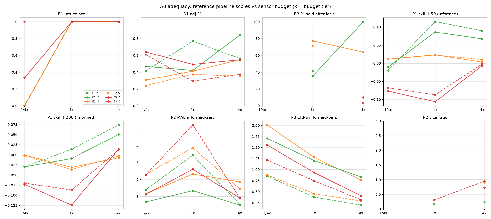

# A0 MEASUREMENT ADEQUACY STUDY — probe-device edition (Track A, W4)

**Date** 2026-08-31 · **code** probes/blobs/agentenv/{device,refpipes,adequacy}.py ·
**worlds** E1=p4g2_044 (21 sparse blobs), E2=p6g8_033 (champion labyrinth+rotors),
E3=p3g9_022 (151-organism swarm) · **seeds** 3/world (base, +1, +2) ·
**grid** 3 budget tiers x 2 rosters x 3 worlds x 3 seeds = 54 cells ·
**method** each (world,seed) simulated ONCE to T=2500tu (f16 frame cache @5tu +
truth blob lists + f32 snapshot at T0=1700 with RNG state); all passive pipeline
variants replay the cache (sensors don't disturb the field — replay==live gated
bitwise via the control branch); P3 injection branches (calib amps 1/2/4 + announced
amp 3 + control) stepped live once per (world,seed) and shared across cells.
Total sim cost ~4.5 CPU-hours wall (parallel, 3 workers/run); each pipeline cell
replays in 5-11 s — the sim-once/replay-many design is what made a 54-cell grid
affordable locally.

## The instrument under test
ProbeDevice = rigid lattice patch (square 13 / hex 19 nodes at 3 rings, base ds
3.0-3.5u), bilinear point sensors, anonymized port ids (secret permutation),
anonymized node order (secret permutation), secret motion basis (rotation+
reflection), dilation control (0.5-3.0x), center source injection through the
poke pathway (sigma=2 Gaussian, amp/tu). Agent-facing observation = k x n_ports
scalar streams + per-port global mean/var + budget counters. NOTHING spatial.

Budget tiers (per 2500tu episode, sensor currency = node-read-seconds):
| tier | duty (fraction of 5tu steps read) | sensor (r1) | motion | injection |
|------|------|------|------|------|
| 4x   | 1.0    | 47500 node-tu | 2400 cu | 240 amp-tu |
| 1x   | 0.25   | 11875         | 600     | 60        |
| 1/4x | 0.0625 | 2969          | 150     | 15        |

Episode phases (500 control steps): A observe(200) -> B geometry probes(42) ->
D closed-loop tracking(72) -> C dilation size scan(14) -> R home(5) ->
E contract window(161; P1 anchors t=1700/1850/2000/2150, H=50/200tu; P2 50tu
windows over (1700,2500]; P3 announced amp-3 injection at dev0's home anchor,
response scored on the OTHER device (r2) / same device (r1) over 250tu).

## Verdict table (3 seeds, r1 = single hex device; r2 = square+hex pair)

| capability | E1 sparse | E2 champion | E3 swarm | budget shape |
|---|---|---|---|---|
| R1 lattice class      | 1x: 100%, 1/4x: 0%      | same | same | CLIFF at 1x->1/4x |
| R1 adjacency F1 (r1)  | 4x .84, 1x .42, q4 .47  | .55/.41/.31 | .55/.49/.64* | steep, world-graded |
| R1 embedding corr (r1)| .89/.64/.50             | .72/.43/.36 | .75/.68/.84* | steep on E1/E2 |
| R1 motion basis       | 4x 67%, 1x 33%, q4 0%   | 100/33/0%   | 33/33/0%     | needs 4x |
| R2 particulate verdict| 100% at all tiers       | 4x only (67%) | 4x 100%, lower 67% | flat-ish E1, steep E2 |
| R2 size via dilation  | 4x only; ratio ~0.24 (skirt-halfwidth vs blob-core r, systematic ~4x under) | fails (no stable pass) | ratio .73-.95 when it fires | 4x only |
| R3 end-to-end acquire (motion-cal x lock) | 4x 67%, 1x 33% | 4x 100% | 4x 33% | steep |
| R3 HOLD after lock (of runs that locked) | 4x 100%, 1x ~35% | 4x 64% | 4x 10% | steep |
| R3 same-blob retention| 4x 79% (100/58/—)       | 4x 51%      | 4x 10%       | world-graded |
| P1 AR2 skill vs climatology, H50 | +.07 | +.00 | -.01 | FLAT in budget |
| P1 skill H200         | +.05 | -.01 | +.01 | flat, near zero |
| P2 event-rate MAE vs zero-baseline | beats at 4x (1.8 vs 8.2) and 1x | ~ties (4.6 vs 4.7) | ~ties | steep E1 only |
| P3 informed vs persistence CRPS | 4x: 5.0x better (.041 vs .206, r2) | 3.4x (.051 vs .174) | 3.2x (.013 vs .041) | steep, works everywhere |
| P3 response detectability z | 620-960 | ~5900 | ~8-10k | detectable at ALL tiers |

*E3 q4/x4 embedding numbers benefit from dense-swarm correlation structure;
they do not translate into downstream capability (motion probe still fails).

## Adequacy curves


## Findings (the study's actual deliverables)

**F1 — The steep region brackets 1x for geometry, 4x for control.**
Lattice-type identification survives down to 1x everywhere but dies at 1/4x
(0% — the ~30-read budget cannot even resolve neighbor order). Adjacency F1 and
embedding fidelity degrade smoothly; the motion basis (prerequisite for ALL
closed-loop skills) is only reliable at 4x, marginal at 1x, dead at 1/4x. If we
want round-1 agents to have a fighting chance at self-calibration, budgets must
sit between 1x and 4x — the curve knee is in that interval.

**F2 — Closed-loop tracking works but is world-graded exactly as feared.**
(R3 runs only when the motion basis calibrated — rates below are conditioned
on that; the motion row carries the calibration rate.)
E1: at 4x the scripted tracker acquires in every run that calibrated (2/3
seeds) and holds ~100% with 79% same-blob
retention over 360tu (median blob r~8-9u vs device radius ~6u — the device is
SMALLER than the blobs it tracks; centroid control still works). E2: acquires
(the labyrinth is everywhere) but identity is ill-posed among reorganizing
stripes — 51% retention is partly definitional. E3 swarm: 10% — blobs move
~1.8u/read through a crowd of 151; the P-controller loses its target to
neighbor-stealing despite prediction gating. This is the honest boundary of
scripted reference pipelines, not a budget artifact (4x doesn't fix it).

**F3 — P1 as currently specified is nearly budget-flat and nearly skill-free.**
AR2 on 5tu-sampled streams beats climatology by only ~7% CRPS on E1 (H=50) and
~0 elsewhere; persistence is WORSE than climatology at H>=50tu everywhere. The
fields decorrelate on ~10-30tu at fixed points, so point-stream forecasting is
mostly irreducible noise + slow-channel mean. IMPLICATION for round 1: P1 at
H=50-200 will not separate good agents from baselines. Either shorten horizons
(H=10-25tu), or score P1 on slow-channel ports only, or weight P2/P3 higher.

**F4 — P2 and P3 are the discriminating contracts.**
P2: on E1 persistence/informed forecasting of s-event rates beats the zero
baseline 4.5x at 4x duty (needs enough duty to SEE crossings; duty-corrected
rate estimation from 25%-duty reads still works: 1x ties 4x on E1). On E2/E3
the home-anchor event rates are noisier; forecasts only tie the mean baseline.
P3: the template-scaled injection-response prediction beats persistence 3-5x
on EVERY world at 4x and stays ahead at 1x; response z-scores 600-10000 mean
announced injections are unmissable at all tiers. P3 is the healthiest
contract: causal, budget-sensitive, world-robust.

**F5 — Roster verdict: r2 (square+hex pair) is the better round-1 roster,
with a caveat.** The pair enables cross-device P3 (device A injects, device B
predicts — the propagation contract that r1 reduces to self-echo), and its P3
informed-CRPS advantage over persistence is bigger (5x vs 1.2x on E1 4x).
Caveat: the square 13-node device is a measurably weaker instrument than hex-19
(fewer nodes, r=2 ring only in diamond directions): its solo motion-basis
recovery failed in most r2 cells (dev0=square does the probing there). Round-1
recommendation: keep r2 but make the HEX device the mobile/probing one and the
square the far witness, or upgrade square to Chebyshev-25.

**F6 — Dilation is a working single-device ruler but was mis-calibrated for
size.** The radial (dilation-wiggle) probe cleanly identifies the center node
and ring ordering (it rescued the geometry snap on E1: adj F1 0.62->1.00 at
4x), and the ring-radius template fit picks the right lattice class. The
absolute size estimate lands on the skirt half-width (~0.2-0.3x core radius on
E1; 0.7-0.95x on E3's smaller blobs) — usable as a relative ruler, biased as an
absolute one. Report ratios, not radii, in round 1 scoring.

**F7 — Things the reference pipelines could NOT do (honest list).**
- Track through the E3 swarm (10% hold; identity chase fails vs 151 neighbors).
- Open-loop pursuit of a blob >2 patch radii away (acquisition = wait for a
  passage or drift-encounter; the watch->track machine is reactive, not
  searching — a smarter agent could do systematic sweeps).
- Estimate absolute blob size through the skirt bias (F6).
- Recover the motion basis at 1/4x budget anywhere, or reliably at 1x.
- Beat climatology at P1 H=200 (may be genuinely near-irreducible for point
  streams; agents with better world models might — that's the contract's job).
- E2 labyrinth 'blob identity': the concept itself frays (stripes reorganize);
  P4-style preparation contracts may suit E2 better than tracking-flavored ones.
- The dilation scan on E2 never found a stable pass (nothing compact to park on
  at the home anchor).

## Recommended round-1 configuration
- **Worlds:** E1 entry (all contracts live), E2 champion (P1/P2/P3; treat
  tracking-adjacent skills as stretch), E3 stretch (P2/P3 only; tracking
  explicitly out of contract round 1 — or priced as a bonus).
- **Roster:** 2 devices, hex-19 (mobile) + square-13 or squareC-25 (witness),
   20-30u apart (calibrated: z~6-8 at 20u for perturbation propagation).
- **Budgets (per 2500tu episode):** sensor 2x baseline duty (~0.5 of full),
  i.e. ~24000 node-tu for the pair; motion 1200 cu; injection 120 amp-tu.
  Rationale: the steep region for geometry+motion is between 1x and 4x; 2x
  puts agents ON the curve (both self-calibration and contracts remain
  budget-limited, neither saturated nor hopeless).
- **Contracts:** P3 primary (cross-device), P2 secondary (announce port+thr
  with a guaranteed nonzero pre-T0 rate — the harness-side pick matters, see
  code), P1 tertiary with H<=25tu added to H=50/200 (F3), all three worlds.
- **Pricing note:** injection response is enormous (z 600-10k). If we want
  nucleation science to be nontrivial, either cap amplitude below 2 or price
  injection steeply; at amp 3 the response is a free beacon.

## Gate status
W1 device layer: 9/9 gates PASS (incl. bitwise step parity vs locked sim_cpu
advance, replay==live 4.6e-4 f16 tolerance, snapshot-branch bitwise).
W2 pipelines: 7/7 gates PASS on synthetic controlled worlds.
W3 study machinery: 4/4 gates PASS (secret sharing across rosters, read plans
within budget, branch-control parity 0.0 vs main cache, smoke cell).
Full pipeline runs: 54/54 cells completed, no errors.

## Barrier audit (b1-b5 spot checks)
- obs dict keys: {t, streams, global_stats, rejected, budget} — no coordinates,
  no lattice/port names, no geometry (gated in test_device T4).
- port ids: secret permutation per world_key; node order: secret permutation
  per device; motion basis: secret rotation+reflection (T5, T9).
- pipelines consume ONLY obs + announced contract specs; truth enters through
  adequacy.py scoring functions (marked evaluator-side).
- world selection/config: deterministic from world_key strings (T9).
- one caveat for the record: scripted pipelines receive the contract clock
  (phase boundaries) — agents will too, via the episode script.

## Reproduce
```
# caches (one-time, ~20 min/[world,seed] at 3 workers):
.../gpu/.venv/bin/python probes/blobs/agentenv/adequacy.py cache --world p4g2_044 --seed 928
# grid for one (world,seed):
.../gpu/.venv/bin/python probes/blobs/agentenv/adequacy.py evalgroup --world p4g2_044 --seed 928
# verdict table + curves:
.../gpu/.venv/bin/python probes/blobs/agentenv/adequacy.py aggregate
# gates:
.../gpu/.venv/bin/python probes/blobs/agentenv/test_device.py
.../gpu/.venv/bin/python probes/blobs/agentenv/test_refpipes.py
.../gpu/.venv/bin/python probes/blobs/agentenv/test_adequacy.py
```
Caches live in probes/blobs/agentenv/cache/ (7-11 GB, gitignored); per-cell
results in probes/blobs/agentenv/results/*.json; curves in figs/.
